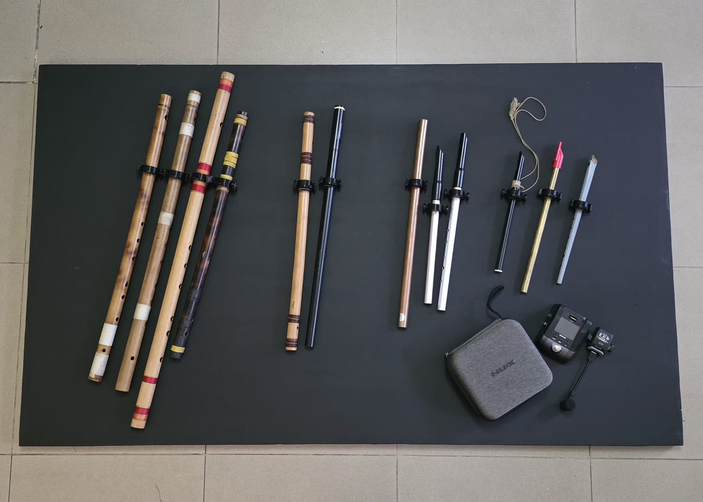
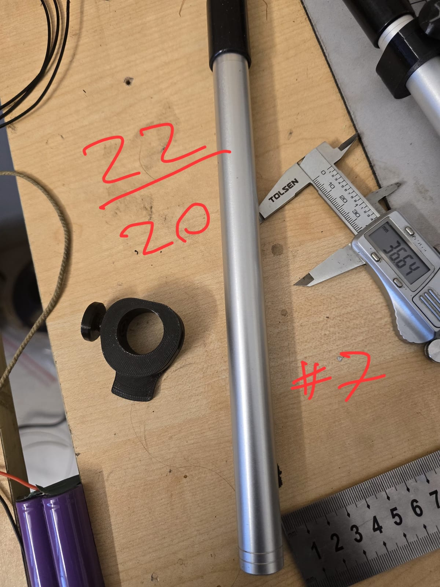
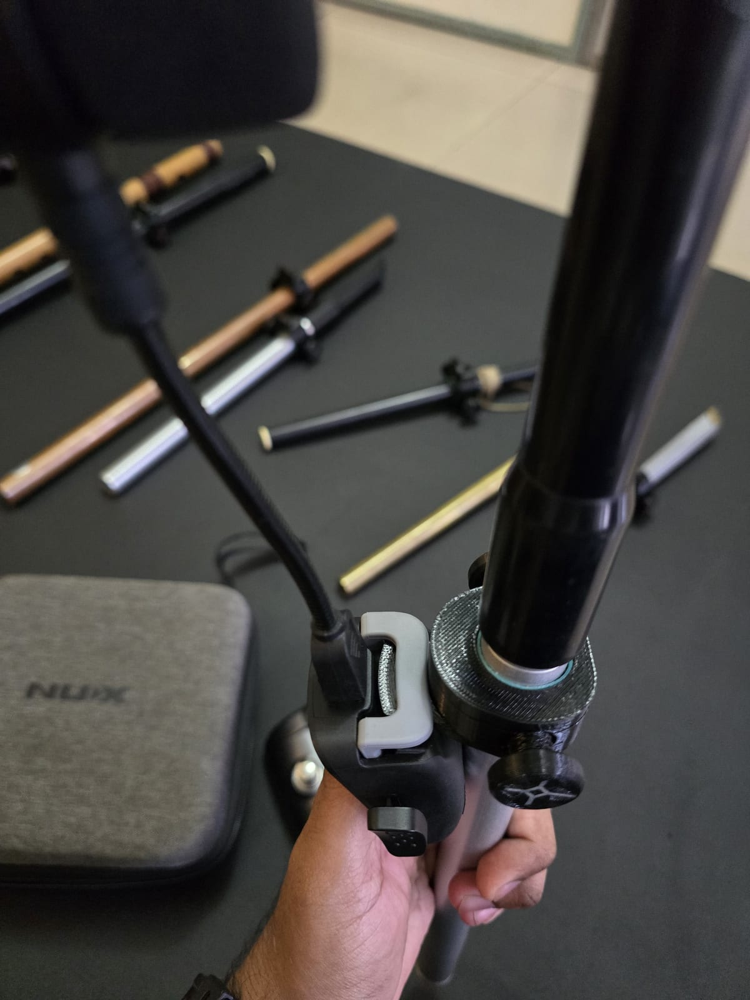
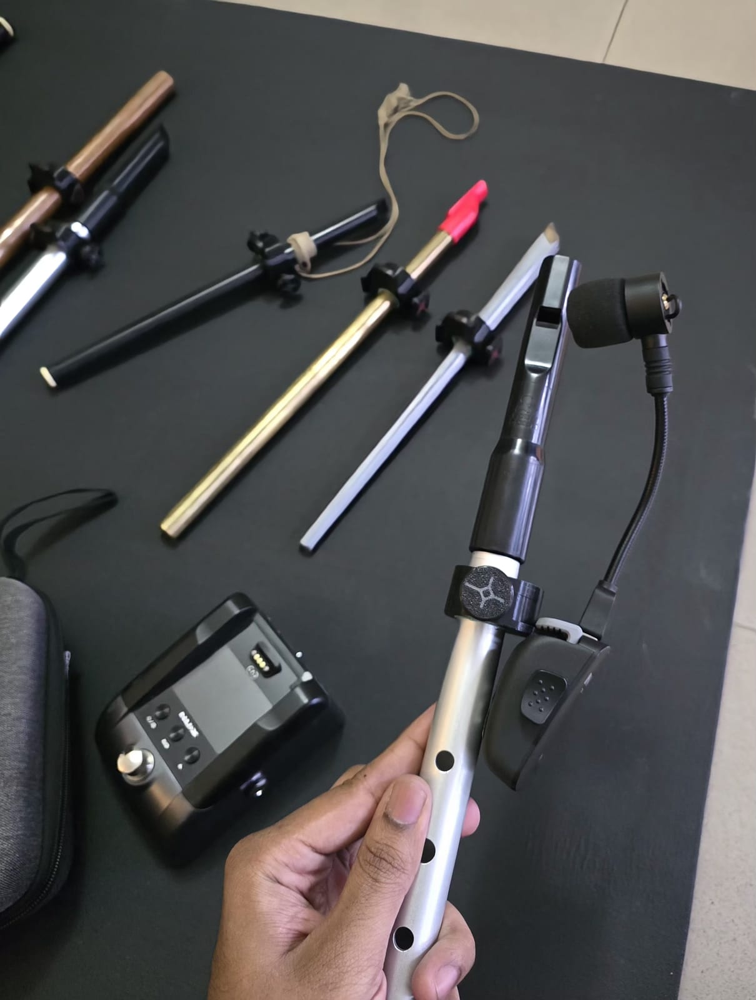

# NUX B-6 flute mount

3D printed clamps that mount a **NUX B-6** or **B-6 Pro** wireless microphone onto a
flute.

*The set this was built for: thirteen flutes in bamboo, aluminium, copper, brass and
resin, each with a clamp fitted, and the B-6 kit bottom right.*

The B-6 is sold for saxophone. It expects to clamp onto a bell: a rigid flared metal mouth
of one known size. A flute is a straight tube, and if you play one there is nothing on the
instrument for the mic to hold. These parts sit between the two.

The clamp is in two layers, which is the whole idea:

- a **rigid PETG split ring** that carries the standard B-6 clip and provides the clamping
  force, closed with printed screws and nuts
- a **flexible TPU spacer** that takes up the difference between the clamp bore and your
  actual tube, and grips without marking the instrument

| | |
| --- | --- |
|  |  |
| The rigid part on its own: split ring, mic boss underneath, printed thumb screw. | Assembled. The pale ring inside the bore is the TPU spacer; the boss takes the B-6 clip. |

Keeping those separate is what makes one clamp cover several flutes. A rigid clamp
tightened straight onto a bamboo flute would slip or dent it, and onto a thin aluminium
tube it would crush it. The TPU does the conforming so the PETG does not have to.

Built in a day for Nazm Anwr, who plays flute for the Bangladeshi band
[Kaaktaal](https://samiulmakes.com/projects/flute-mic-clamps/), because he performs with
thirteen flutes and swaps between them mid-set. The screws are printed too: no hardware
run, nothing metal to lose in a green room, and a thumb screw big enough to turn by hand
between songs.

Full write-up, with photos of the whole set:
**<https://samiulmakes.com/projects/flute-mic-clamps/>**

## Sizes

Five clamp bores, ten spacers. Pick the clamp that fits over your flute, then the spacer
that brings it down to your diameter.

| Clamp bore | Spacer inner diameters |
| --- | --- |
| 22 mm | 15, 16, 20 |
| 24 mm | 22, 22.5 |
| 28 mm | 24.5, 26.5 |
| 30 mm | 27.5 |
| 35 mm | 30, 33 |

Measure your flute with callipers at the point you want the mic to sit, which is usually
just below the embouchure hole and clear of the finger holes.

## If your flute is between sizes

You need a **new spacer, not a new clamp**. Take the clamp bore above your diameter, open
the CAD, change the spacer's inner diameter, print it. That is a one-parameter change and
a few minutes of printing.

Which is the reason the source file is here and not just the STLs.

## Printing

| Part | Material |
| --- | --- |
| Clamp shells | PETG |
| Thumb screws | PETG |
| Spacers | TPU |

<!-- TODO (Samiul): layer height, walls, infill, TPU shore hardness, whether the screws
     need a particular orientation. Not filled in because guessing print settings for
     someone else's printer is worse than saying nothing. -->

## Fasteners

The clamp closes with printed thumb screws, in three shank lengths:

| Part | Shank |
| --- | --- |
| `screw-6mm.stl` | 6 mm |
| `screw-8mm.stl` | 8 mm |
| `screw-10mm.stl` | 10 mm |

All three share the same head: a 20 mm disc, 5 mm thick, with knurl lobes standing out to
25 mm so it can be turned with cold fingers. The thread is a printed one, roughly 10 mm
across, not an M-series profile — these mate with the clamps here and with nothing else.

Longer shanks are for the bigger bores, where the split has further to close. If you are
unsure, print the 8 mm first.

<!-- TODO (Samiul): nuts. The clamp closes screw-into-nut, but only the screws came
     across. Export the nut from cad/screws-v5.f3d. -->

## Files

`cad/flute-adapter-v19.f3d` — the parametric Fusion 360 source for the clamps and
spacers, and the file you want if your flute is not on the list.

`cad/screws-v5.f3d` — the Fusion source for the thumb screws.

`stl/` — 18 parts, ready to print:

| Clamp | Spacers |
| --- | --- |
| `clamp-22mm.stl` | `spacer-22-to-15mm.stl`, `spacer-22-to-16mm.stl`, `spacer-22-to-20mm.stl` |
| `clamp-24mm.stl` | `spacer-24-to-22mm.stl`, `spacer-24-to-22.5mm.stl` |
| `clamp-28mm.stl` | `spacer-28-to-24.5mm.stl`, `spacer-28-to-26.5mm.stl` |
| `clamp-30mm.stl` | `spacer-30-to-27.5mm.stl` |
| `clamp-35mm.stl` | `spacer-35-to-30mm.stl`, `spacer-35-to-33mm.stl` |

Plus three thumb screws — `screw-6mm.stl`, `screw-8mm.stl`, `screw-10mm.stl` — which fit
every clamp. See [Fasteners](#fasteners).

Every spacer is 18 mm tall, so it sits fully inside the clamp it belongs to. A spacer only
fits its own clamp; the outer profile changes with the bore.

## Licence

<!-- TODO: pending Samiul's decision. -->

## In use

*The mic head sitting where it needs to sit, on a flute that had nowhere to mount
anything. These held up through a live set and are still in use.*

## Credits

Designed by [Samiul Hoque](https://samiulmakes.com) with Nazm Anwr.
NUX and B-6 are trademarks of their respective owner; this project is not affiliated with
or endorsed by NUX.
